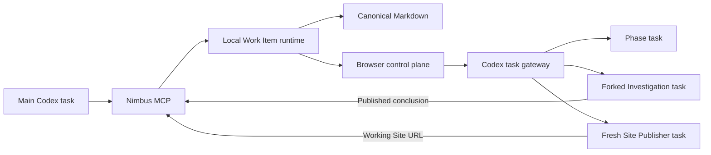

# Nimbus

Nimbus is a local browser control plane for Codex-driven development. A developer explicitly starts one
Work Item with `$nimbus`, continues every conversation and code change in Codex, and uses the browser to
understand state and initiate structured actions across:

```text
Grill -> Plan -> Implement -> Review -> Handoff
```

Comprehension is a phase-local lens throughout the workflow. The browser contains no chat, invokes no
models itself, and edits no code.

## MVP contract

- One canonical, human-readable file at `docs/nimbus/<work-item-id>.md`.
- Adaptive one-question-at-a-time Grilling with context, Options, effects, pros, cons, and a recommendation.
- Separate Codex Investigation tasks that publish only developer-approved conclusions.
- Full-document Plan review with annotations, revision requests, and disposable diffs.
- One active Plan Item during Implementation, followed by one evidence-backed Implementation Result.
- Review derived from Decisions, Plan Items, actual results, deviations, evidence, and Investigations.
- A reviewed Handoff that completes the Work Item.
- An optional `Publish Handoff Site` action that must return and persist a real, openable Site URL.

## Architecture



Nimbus is the sole automated Markdown writer. Phase tasks and browser actions submit bounded updates;
the runtime re-reads the file, validates IDs, references, and staleness, then applies one semantic change.

## Run the prototype

```sh
npm install
npm run dev
```

Open `http://127.0.0.1:5173`, then follow [TESTING.md](./TESTING.md).

## Verify it

```sh
npm run typecheck
npm test
npm run build
npm run test:plugin-runtime
npm run test:e2e
node scripts/validate-plugin.mjs
```

The automated suite covers the deterministic local product. Site publication additionally requires the
live acceptance journey in [TESTING.md](./TESTING.md); a simulated publication result is insufficient.

## Product sources

- [Product vocabulary](./CONTEXT.md)
- [Approved MVP design](./docs/superpowers/specs/2026-07-18-nimbus-mvp-design.md)
