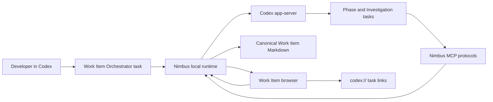

# Nimbus MVP Design

**Status:** Design approved through grilling  
**Date:** 2026-07-18

## Product definition

Nimbus is an explicit, opinionated workflow layered on top of the Codex app. It helps a developer
understand and guide one Work Item from consequential decisions through an evidence-backed handoff.

The developer talks only in Codex. Nimbus adds a local browser workspace for visualizing state and
initiating structured actions. The browser contains no chat, makes no model calls, and edits no code.

```text
Grill -> Plan -> Implement -> Review -> Handoff
```

Comprehension is available throughout the workflow through readable context, separate Investigations,
intent-to-implementation mappings, and code evidence. It is not a separate phase.

It is also not a permanent generic panel. Each phase exposes the comprehension relevant to the work at
hand, while Review assembles the complete reconciliation view.

## Problem

Linear coding-agent conversations collapse explanation, decision-making, planning, execution, and
review into one context window. Developers who are still learning by building can move quickly but lose
the ability to compare options, interrogate one branch deeply, or later explain why the implementation
looks the way it does.

IDEs expose code at too low a level for this job. Agent chat exposes the process at too high a level.
Nimbus supplies the middle layer: one readable Work Item and one browser view of its Decisions, Plan,
Implementation, and Handoff.

## MVP goals

- Start Nimbus only through an explicit `$nimbus` invocation in Codex.
- Conduct adaptive, one-question-at-a-time Grilling in Codex.
- Visualize each Decision as context plus credible Decision Options in a progressive tree.
- Fork a separate Codex Investigation task from any meaningful artifact without polluting its owner.
- Review and annotate one complete Plan document in a Plannotator-style browser surface.
- Show every Plan Item during Implementation and map it to one Implementation Result with code evidence.
- Reconcile Plan against Implementation before accepting a Handoff.
- Publish the reviewed Handoff as a static explainer through the Sites plugin.
- Keep one human-readable, Git-trackable Markdown file as authoritative project memory.
- Provide a deterministic local demo and a real Codex app-server smoke journey.

## Non-goals

- Automatic activation based on ordinary prompts.
- A generic skill marketplace, skill picker, or compatibility registry.
- User-composed phase skills.
- Browser chat or browser-hosted model responses.
- Browser code editing.
- Direct IDE integration or editor-specific URI generation.
- Parallel Plan Item implementation.
- Raw command, file-read, or token activity logs.
- A permanent verification status for Implementation Results.
- A database, Nimbus account, Nimbus cloud, or Nimbus-owned hosting.
- PR automation in the MVP.

## Product architecture

The plugin bundles fixed Nimbus methods, an MCP server, a local runtime, and the browser application.
Codex remains the coding harness and owns all repository tools and conversation.



### Ownership boundaries

| Owner                       | Responsibility                                                                              |
| --------------------------- | ------------------------------------------------------------------------------------------- |
| Work Item Orchestrator task | Opens the Work Item, launches phases, receives phase completion, and handles transitions.   |
| Phase task                  | Conducts exactly one phase with a confirmed model and fixed Nimbus Method.                  |
| Investigation task          | Provides a private fork for deep interrogation and publishes only an approved conclusion.   |
| Browser workspace           | Renders Markdown-derived state and sends structured actions.                                |
| Nimbus runtime              | Creates or forks tasks, validates updates, writes Markdown, and streams transient UI state. |
| Codex                       | Performs reasoning, conversation, repository inspection, implementation, and review.        |

Browser actions return to the task that owns the artifact. Only phase transitions return to the Work
Item Orchestrator.

| Browser action                       | Destination                 |
| ------------------------------------ | --------------------------- |
| Select a Decision Option             | Grill task                  |
| Request a Plan revision              | Plan task                   |
| Open implementation evidence         | Implementation task         |
| Request an implementation correction | Resumed Implementation task |
| Approve a phase and continue         | Work Item Orchestrator task |

## Fixed Nimbus methods

Nimbus is opinionated in the MVP. Developers choose the model, not the working method.

| Task          | Fixed Method         | Governing principles                                                                                      |
| ------------- | -------------------- | --------------------------------------------------------------------------------------------------------- |
| Grill         | Nimbus Grill         | Adaptive one-question grilling, readable context, credible options, repository grounding when docs exist. |
| Plan          | Nimbus Plan          | Complete executable Plan, simplicity, explicit boundaries, and no unnecessary architecture.               |
| Implement     | Nimbus Implement     | Follow the accepted Plan in order, keep changes bounded, report deviations, and attach code evidence.     |
| Review        | Nimbus Review        | Strict evidence-backed reconciliation, prioritize meaningful problems, and request explicit corrections.  |
| Investigation | Nimbus Investigation | Explain one focused issue deeply without changing the owning artifact until a conclusion is published.    |
| Publish       | Nimbus Publish       | Turn the reviewed Handoff into a static evidence-backed explainer through Sites.                          |

The Methods are implemented as Nimbus-owned skills derived from the principles of the supplied
`grill-me`, `grill-with-docs`, `ponytail`, `poteto-mode`, and
`thermo-nuclear-code-quality-review` skills. They are not copies and are not independently selectable.

Each Method operates inside a Phase Protocol. The Method controls how Codex works; the Protocol defines
the structured artifact that Nimbus accepts. MCP schemas and runtime validation enforce the Protocol.

## Task launch and task isolation

Every newly created visible Codex task requires a browser Task Launch Confirmation. The sheet shows the
task type, fixed Method, bounded context summary, and a model picker populated through Codex
`model/list`.

```text
Launch Implementation

Method: Nimbus Implement
Context: NIM-001 accepted Plan, 4 Plan Items
Model:  [ selected model ]

[ Launch ]
```

Nimbus cannot create the task until the developer confirms the model. Resuming an existing task does not
ask again. The same rule applies to Investigations. Clicking implementation evidence is only navigation
to an existing task and therefore does not ask for a model.

Suggested task titles:

```text
NIM-001 - Orchestrator
NIM-001 - Grill
NIM-001 - Plan
NIM-001 - Implement
NIM-001 - Review
NIM-001 - Investigate D-02
NIM-001 - Publish Handoff
```

Phase tasks start with bounded Work Item context rather than the complete prior conversation. An
Investigation uses true `thread/fork` from the latest completed turn of its Owning Phase Task plus a
focused context packet. Its full conversation remains in Codex.

The task gateway must create tasks that are visible and resumable in the developer's running Codex app.
A private standalone app-server process whose tasks are isolated from the app does not satisfy the MVP.
This integration path is a feasibility gate before the broader runtime and browser migration.

## Comprehension semantics

Comprehension is a phase-local lens over canonical Work Item records and supporting Codex task history.
It does not introduce another workflow, top-level Markdown section, or family of graph nodes.

| Phase     | Comprehension exposed in the browser                                                                |
| --------- | --------------------------------------------------------------------------------------------------- |
| Grill     | Decision context, Options, trade-offs, recommendation, and Investigation entry points.              |
| Plan      | Decision rationale, Plan annotations, change effects, and Investigation entry points.               |
| Implement | Current Plan mapping, reported actual result, deviation, and code evidence.                         |
| Review    | Complete actual behavior, decision fidelity, model changes, unknowns, evidence, and Investigations. |
| Handoff   | Audience-ready outcome, mental-model before and after, evidence, and unresolved concerns.           |

The complete Review lens uses these derived concepts:

- **Actual behavior** comes from each Implementation Result's actual result and code evidence.
- **Decision fidelity** follows `Decision -> Plan Item -> Implementation Result -> Evidence Link` and
  highlights faithful, deviated, or unresolved paths. It is not a score or permanent verification state.
- **Model changes** are meaningful differences between the pre-implementation understanding and what the
  implementation revealed. They derive from Decisions, deviations, published Investigations, and actual
  behavior.
- **Unknowns** are unresolved concerns anchored to their source, such as an Investigation, missing
  mapping, deviation, contradictory evidence, or Review finding. They are not standalone nodes.
- **Evidence** consists of repository-relative file and line-range references attached to Implementation
  Results.
- **Investigations** are separate Codex tasks whose published conclusions attach to their owning Work
  Item artifact. Their transcripts remain isolated.

A **System Model** is a derived browser or Handoff diagram generated from accepted records and evidence;
it is not canonical state. A **Session Trace** is supporting Codex task history that Nimbus may link to but
never copies into the Work Item as primary evidence.

## Canonical Work Item Markdown

Each Work Item owns exactly one file:

```text
docs/nimbus/<work-item-id>.md
```

The file is the authoritative project memory. Nimbus may keep disposable Plan draft snapshots and
transient browser state while a session is active, but they are not project records.

The document uses human-readable Markdown. YAML front matter contains only document and local task
metadata. The body contains these top-level sections in canonical order:

```text
Brief
Decisions
Plan
Implementation
Handoff
```

Review is derived from existing artifacts and does not add a duplicate section. Full Investigation
transcripts, private conclusions, Plan draft history, annotations awaiting submission, and Implementation
Activity are not persisted in the Work Item Markdown.

### Stable IDs

Artifact IDs are visible and immutable:

```text
D-01       Decision
D-01/A     Decision Option
P-01       Plan Item
IR-01      Implementation Result
```

Titles and content may change without changing IDs. Retired IDs are never renumbered or reused.

### Markdown template

```markdown
---
id: NIM-001
title: Add server-side sessions
phase: implementing
source: HYB-123
createdAt: 2026-07-18T10:00:00Z
updatedAt: 2026-07-18T11:30:00Z
tasks:
  orchestrator: <codex-task-id>
  grill: <codex-task-id>
  plan: <codex-task-id>
  implement: <codex-task-id>
---

# Brief

## Problem

...

## Goal

...

## Scope

- ...

## Constraints

- ...

## Acceptance criteria

- ...

# Decisions

## D-01: Where should session state live?

### Context

Readable description of the issue and current environment.

### Options

#### D-01/A: Server-side sessions

Explanation of the direction.

**Concrete effects**

- ...

**Pros**

- ...

**Cons**

- ...

### Recommendation

`D-01/A`, because ...

### Accepted

`D-01/A`, because ...

<details>
<summary>Revision history</summary>

1. `2026-07-18T10:00:00Z` - Accepted `D-01/B` because ...
2. `2026-07-18T11:30:00Z` - Superseded `D-01/B` with `D-01/A` because ...

</details>

**Published investigations**

- `2026-07-18T11:00:00Z` - **Conclusion:** ... **Rationale:** ... **Evidence:** ... **Unresolved:** ...
  **Task:** `codex://threads/<task-id>`

# Plan

## P-01: Add the shared session contract

**Supports:** D-01

**Outcome:** ...

**Implementation boundary:** ...

# Implementation

## P-01: Add the shared session contract

### IR-01: Implemented

**Actual result:** ...

**Deviation:** None.

**Code evidence**

- `packages/shared/session.ts:12-38` - Defines the shared contract.
- `apps/api/session-store.ts:20-74` - Uses the shared contract.

# Handoff

## Summary

- ...

## Contracts

- ...

## Unresolved

- ...

## Next actions

- ...

## Delivery actions

- Handoff Site: <published-url>
```

Nimbus parses this format with a Markdown AST and validates its semantic structure. It does not keep a
duplicated JSON document, YAML payload sections, or a sidecar data file.

The current accepted Decision answer always appears before its collapsed, timestamped Revision history.
Revisions keep the Decision's stable ID and do not receive IDs of their own. If an answer changes after
Implementation begins, Nimbus preserves the Accepted Plan and exposes the resulting mismatch through
Implementation and Review.

Any Work Item, Decision, Decision Option, Plan Item, or Implementation Result may include a compact
`Published investigations` list. Every entry contains the approved conclusion, rationale, relevant
evidence, unresolved risk, and Codex task link. Entries have no Artifact IDs, and private conclusions or
full transcripts never enter the Markdown.

### Update ownership

Nimbus is the sole automated writer. Phase tasks and browser actions submit structured Work Item Updates
to the runtime. For each update, the runtime:

1. Re-reads the current file.
2. Parses and validates the current structure.
3. Computes the SHA-256 hash of the current canonical Markdown and rejects the update unless it matches
   the update's `expectedDocumentHash`.
4. Validates all referenced Artifact IDs.
5. Applies one bounded semantic mutation.
6. Serializes the human-readable Markdown.

Developers may edit the Markdown manually. The next automated update must parse and validate those edits
before writing anything. Browser and task responses receive the latest document hash with Work Item state
and must submit it with every mutation; Nimbus never silently merges a stale action.

## Workflow

### 1. Invoke and open

1. The developer explicitly includes `$nimbus` in a normal Codex prompt.
2. The Nimbus orchestration skill creates or resumes the Work Item and captures its Brief.
3. Nimbus identifies the unique active Codex task for the repository and records it as the Orchestrator.
4. The runtime opens the local browser workspace for that Work Item.
5. The browser presents the Grill Task Launch Confirmation.

Nimbus never activates through prompt matching alone.

### 2. Grill

Nimbus Grill asks one genuine Decision at a time. Each Decision contains:

- readable issue and current-environment context;
- two or three credible Decision Options;
- explanation and concrete effects for every Option;
- honest pros and cons;
- one explicit recommendation with rationale.

The browser renders a progressive React Flow tree. The current Decision is prominent, the accepted path
remains visible, rejected Options collapse but remain inspectable, and the next Decision appears only
after the developer selects an Option and the Grill task responds.

Selecting an Option returns the structured answer to the waiting Grill task. The Grill task persists the
Decision and either asks the next question or declares Grilling complete.

### 3. Investigate

Any Work Item, Decision, Decision Option, Plan Item, or Implementation Result can start an Investigation.

1. The developer clicks Investigate in the browser.
2. The browser asks for the Investigation model.
3. Nimbus forks the Owning Phase Task from its latest completed turn and supplies focused artifact context.
4. The browser deep-links to the new Codex Investigation task.
5. The developer conducts all back-and-forth conversation in Codex.
6. The Investigation remains private unless the developer explicitly publishes a conclusion.
7. Publishing returns only the accepted finding, rationale, evidence, and unresolved risk to the owning artifact.

The browser redraws from Markdown after publication. It never displays the Investigation transcript.

### 4. Plan

The Plan task receives the Brief and accepted Decision path. Nimbus Plan produces one complete Markdown
Plan with stable Plan Items. The browser renders the full document, not cards.

The developer can select Plan text and create a comment, insertion, replacement, or deletion. The
developer may also start an Investigation from the Plan or one Plan Item. Annotations and published
Investigation conclusions collect into one Plan Change Set.

One explicit Request Revision action returns the complete Change Set to the Plan task. The task produces
a new full-document draft. Disposable snapshots support line-level comparison during review. Only the
latest approved Plan enters the canonical Work Item Markdown.

The Accepted Plan becomes immutable when Implementation starts. Later differences are recorded as
Implementation deviations or new Decisions, never as retroactive Plan edits.

### 5. Implement

The browser lists every Plan Item in accepted order. Exactly one item is active.

```text
Implemented  P-01  Add shared contract
Working      P-02  Add session repository
Pending      P-03  Connect callback
```

While Codex works, the active row shows a spinner and a short rotating present-tense phrase such as
`Reading context`, `Tracing dependencies`, `Editing code`, or `Connecting pieces`. This is transient
presentation state and is never written to Markdown.

Nimbus does not persist started, verified, or command-level milestones. The Implementation task updates
the Work Item only when it reports a Plan Item implemented. That update creates one corresponding
Implementation Result containing:

- a concise description of the actual result;
- any deviation from the Plan;
- one or more repository-relative file and line-range references.

Decision mapping is transitive:

```text
Decision -> Plan Item -> Implementation Result -> Code evidence
```

An Implementation Result does not need duplicate direct Decision references. One Result may contain many
evidence links, and the same file may support several Results.

Clicking code evidence in the browser opens the owning Implementation task through
`codex://threads/<task-id>`. Nimbus does not launch an editor, inspect the preferred editor setting, or
construct `vscode://` or `cursor://` links. Native code references inside Codex remain responsible for
opening the developer's preferred editor.

### 6. Review and correction

Review is a derived browser view over Decisions, Plan Items, Implementation Results, published
Investigation conclusions, and code evidence. It shows the complete mapping but prioritizes:

- missing Implementation Results;
- reported deviations;
- weak, invalid, or contradictory code evidence;
- meaningful mental-model changes;
- unresolved concerns.

Matched items remain collapsed but inspectable. The developer can accept the implementation,
Investigate a concern, or add a requested correction. Corrections collect into one Implementation Change
Set.

Submitting the Change Set resumes the existing Implementation task. After corrections are reported,
Nimbus returns to Review. There are no automatic fixes and no permanent `verified` status on an
Implementation Result.

### 7. Handoff and Site

The reviewed Handoff is the universal final artifact. It summarizes the implemented outcome, relevant
Decisions, deviations, contracts, unresolved work, and required next actions without copying the entire
Plan or Implementation section.

Accepting the Handoff completes the Work Item. `Publish Handoff Site` is the only Delivery Action in the
MVP, but it remains optional and does not block or reopen the accepted Handoff. The browser presents it as
an available action after completion rather than as a required phase transition.

Publishing launches a separately confirmed Publish task with a bounded publication packet. The task uses
the Sites plugin to create and host a real static explainer that may include:

- outcome and audience-specific summary;
- Decision rationale;
- Plan-to-Implementation mapping;
- mental-model before and after diagrams;
- captured UI screenshots or recordings when available;
- code evidence and unresolved concerns.

When the developer starts publication, the runtime creates a transient, single-use publication attempt
bound to the Work Item ID and a digest of the accepted Handoff. The fresh Publisher task receives that
attempt token and the bounded Handoff packet. After Sites deploys the explainer, the task calls
`record_handoff_site` with the token and returned URL.

The runtime rejects stale attempts and non-HTTPS URLs, then retries a real reachability request before
opening the URL for the developer. Only after the hosted page responds successfully does Nimbus persist
the URL under the Handoff's `Delivery actions`. A failed attempt remains explicit and retryable but is not
canonical Work Item state; there is no simulated-success or placeholder-URL fallback. Failure does not
change the accepted Handoff. The Work Item Markdown remains authoritative.

## Browser experience

The browser opens directly into the active Work Item, not a landing page. Its fixed phase navigation is:

```text
Grill | Plan | Implement | Review | Handoff
```

Expected phase surfaces:

| Phase     | Primary browser surface                                                     |
| --------- | --------------------------------------------------------------------------- |
| Grill     | Progressive Decision tree with current context and Option details.          |
| Plan      | Full Markdown document with selection-based annotations and Plan diff.      |
| Implement | Dense ordered Plan Item list with one spinner or one mapped Result per row. |
| Review    | Mapping-by-exception view with corrections and Investigation entry points.  |
| Handoff   | Readable final handoff and Publish Handoff Site action.                     |

The browser is a control plane. Buttons initiate structured actions and then navigate back to Codex when
conversation or coding is required. There is no message composer anywhere in the browser.

## Runtime contracts

The MVP keeps MCP tools single-purpose:

| Tool                               | Responsibility                                                              |
| ---------------------------------- | --------------------------------------------------------------------------- |
| `open_work_item`                   | Create or resume a Work Item and open its browser workspace.                |
| `present_decision`                 | Present one Decision and wait for the selected Option.                      |
| `present_plan`                     | Present one full Plan draft and wait for approval or a Plan Change Set.     |
| `begin_plan_item`                  | Set the one transient active Plan Item for browser presentation.            |
| `report_implementation_item`       | Persist one implemented Plan Item, deviation, and code evidence.            |
| `present_review`                   | Present derived reconciliation and wait for acceptance or a correction set. |
| `publish_investigation_conclusion` | Persist only an explicitly approved Investigation conclusion.               |
| `present_handoff`                  | Present and persist the reviewed Handoff.                                   |
| `record_handoff_site`              | Validate a publication attempt and persist its reachable Site URL.          |

The browser uses the local runtime for task launch, task navigation, annotations, option selections, and
correction collection. The runtime uses Codex app-server `model/list`, `thread/start`, `thread/fork`, and
thread discovery APIs.

## Validation and failure behavior

Nimbus fails explicitly when:

- the active Orchestrator task cannot be identified uniquely;
- a requested model is unavailable;
- a task cannot be created, forked, resumed, or deep-linked;
- Work Item Markdown is malformed;
- a Work Item Update is stale;
- an Artifact ID is missing, reused, or references the wrong artifact type;
- more than one Plan Item is made active;
- an Implementation Result is reported for the wrong Plan Item;
- evidence escapes the repository root;
- a file does not exist or a line range is outside the file;
- a browser action targets an expired task or artifact.

Nimbus never silently changes the selected model, drops evidence, guesses another task, rewrites a stale
file, or substitutes an editor.

## Verification strategy

### Deterministic demo

The repository keeps a seeded Work Item and deterministic runtime mode so the complete browser can be
viewed without a live Codex task. The demo simulates:

- progressive Decision selection;
- Investigation launch UI without starting a model;
- Plan annotation, revision request, and diff;
- sequential Plan Item loading phrases;
- Implementation Results with code-line evidence;
- Review corrections;
- Handoff and Site publication result.

This is the primary surface for rapid product iteration.

### Automated checks

- Markdown AST round-trip and semantic validation over a complete Work Item fixture.
- MCP-to-runtime integration journey from Decision through Handoff.
- Stale-update, invalid-ID, path traversal, invalid-line-range, and double-active-item failures.
- Plan Change Set batching and full-document diff behavior.
- Investigation publication without transcript leakage.
- App-server model listing, task start, true fork, resume, and `codex://threads` navigation smoke.
- Live Site publication smoke: launch the confirmed Publish task, generate and host through Sites, return
  the URL, open it, and confirm that the rendered outcome matches the Handoff packet.
- Playwright journeys at desktop and mobile viewports with screenshot and overlap checks.
- Plugin manifest, production build, typecheck, formatter, and existing test gates.

### Manual acceptance journey

1. Start in Codex with `$nimbus` and a normal feature request.
2. Open the Work Item browser.
3. Confirm a Grill model and launch its task.
4. Select a Decision Option in the browser and receive the next question in the Grill task.
5. Confirm a model and fork an Investigation; publish one conclusion.
6. Confirm a Plan model, annotate the full Plan, request one revision, and approve it.
7. Confirm an Implementation model and watch one Plan Item spinner at a time.
8. Inspect mapped Implementation Results and click code evidence back to the Implementation task.
9. Confirm a Review model, request a correction, and return to Review.
10. Accept the Handoff, confirm that the Work Item is complete, and optionally publish its static Site.
11. Open the real published URL and confirm that the Handoff outcome, mappings, evidence, and unresolved
    concerns render correctly.

## Acceptance criteria

- Nimbus starts only through explicit `$nimbus` invocation.
- Every new Phase or Investigation task requires explicit model confirmation.
- All conversation and code work happen in Codex, never in the browser.
- Grilling is adaptive and shows context, credible Options, effects, pros, cons, and recommendation.
- Investigations are true separate Codex tasks and publish only an approved conclusion.
- The Plan is reviewed as one complete Markdown document with batched annotations and disposable drafts.
- Exactly one Plan Item is active during Implementation.
- A Plan Item changes only when its Implementation Result is reported.
- Every Implementation Result includes repository-relative file and line-range evidence.
- Browser evidence links return to Codex and never hardcode an editor.
- Review can request an explicit Implementation correction loop.
- Accepting the reviewed Handoff completes the Work Item without requiring Site publication.
- Publish Handoff Site launches a real Sites publication task, returns a working URL, persists it under
  Delivery actions, and passes the live publication smoke journey.
- One human-readable Markdown file remains the only durable Nimbus project record.
